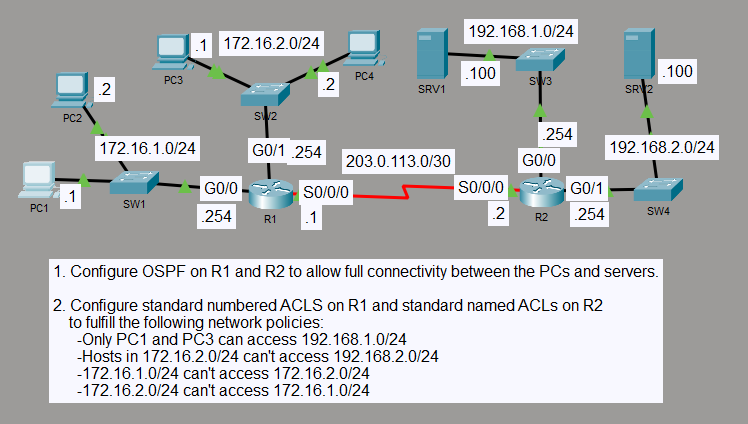

# Standard ACL Traffic Filtering with OSPF

## Objective

I configured OSPF between R1 and R2 to provide connectivity across four LANs, then used standard ACLs to enforce host- and subnet-based access policies. R1 uses numbered standard ACLs, while R2 uses named standard ACLs.

## Topology

## Concepts

- OSPF Area 0
- Standard numbered ACLs
- Standard named ACLs
- Source-based traffic filtering
- ACL placement and direction
- Wildcard masks

## Configuration Highlights

- R1 and R2 formed an OSPF adjacency across the 203.0.113.0/30 serial link.
- R1 used numbered standard ACLs to block traffic between the 172.16.1.0/24 and 172.16.2.0/24 LANs.
- R2 used a named standard ACL so only PC1 (172.16.1.1) and PC3 (172.16.2.1) could reach 192.168.1.0/24.
- R2 used a second named standard ACL to block 172.16.2.0/24 from reaching 192.168.2.0/24.
- The standard ACLs were applied outbound on the destination-facing interfaces so filtering remained close to the destination networks.

## Verification

I verified the R1-R2 OSPF neighbor relationship in FULL state and confirmed that both routers learned the remote LAN routes through OSPF.

I checked the ACL entries, interface directions, match counters, and end-to-end ping results. The permitted and denied paths matched the required access policies.

## Result

OSPF provided routing between all four LANs, while the standard ACLs enforced the required host and subnet restrictions without blocking permitted traffic.
