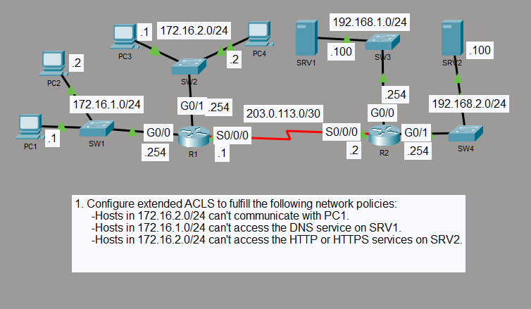

# Extended ACL Traffic Filtering

## Objective

I configured extended ACLs on R1 to enforce host- and service-specific access policies between the LANs. The filters restrict selected DNS, HTTP, HTTPS, and host traffic while allowing unrelated IP traffic to continue.

## Topology

## Concepts

- Extended ACLs
- Source and destination filtering
- TCP and UDP port filtering
- Inbound ACL placement
- Wildcard masks
- ACL match counters

## Configuration Highlights

- `LAN1_FILTER` blocks DNS traffic from 172.16.1.0/24 to SRV1 at 192.168.1.100 while permitting other IP traffic.
- `LAN2_FILTER` blocks 172.16.2.0/24 from reaching PC1 at 172.16.1.1.
- `LAN2_FILTER` also blocks HTTP and HTTPS traffic from 172.16.2.0/24 to SRV2 at 192.168.2.100 while permitting other IP traffic.
- Both extended ACLs are applied inbound on the source-facing R1 interfaces.

## Verification

I verified the ACL entries, interface directions, match counters, and end-to-end traffic behavior.

DNS resolution from 172.16.1.0/24 to SRV1 was blocked, while the same DNS service remained reachable from 172.16.2.0/24. Access from 172.16.2.0/24 to PC1 was denied, and HTTP/HTTPS access to SRV2 was blocked while other permitted traffic remained reachable.

## Result

The extended ACLs enforced all required host and service restrictions without blocking unrelated permitted traffic.
