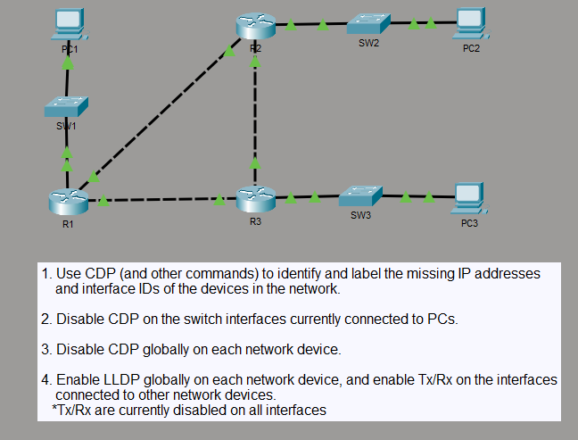
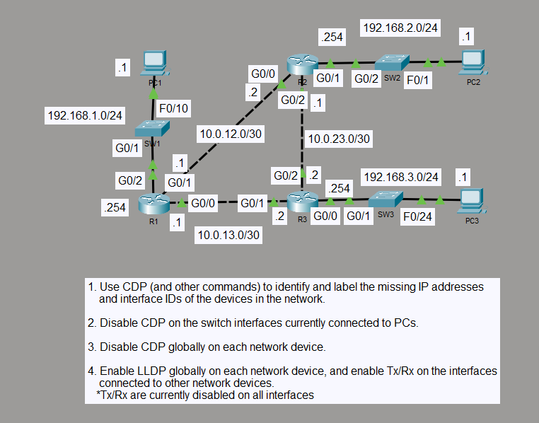

# CDP and LLDP Neighbor Discovery

## Objective

I used CDP and interface information to identify the missing IP addresses and interface IDs in the topology. I then disabled CDP and moved neighbor discovery to LLDP, enabling LLDP only on links between network devices.

## Topology

### Labeled Topology

## Concepts

- Cisco Discovery Protocol (CDP)
- Link Layer Discovery Protocol (LLDP)
- Neighbor discovery
- Interface and IP identification
- Global and interface-level discovery control
- LLDP transmit and receive control

## Configuration Highlights

- CDP was disabled globally on all routers and switches.
- CDP remained explicitly disabled on the switch ports connected to PCs.
- LLDP was enabled globally on all network devices.
- LLDP transmit and receive were enabled on router-to-router and router-to-switch links while PC-facing switch ports remained excluded.

## Verification

I verified LLDP operation with `show lldp` and `show lldp neighbors`. R1 discovered R2, R3, and SW1; R2 discovered R1, R3, and SW2; and R3 discovered R1, R2, and SW3.

I also checked the switch configurations to confirm the PC-facing CDP restrictions and the final LLDP interface state.

## Result

CDP was removed from active neighbor discovery, and LLDP provided neighbor visibility across the infrastructure links while PC-facing switch ports remained excluded.
