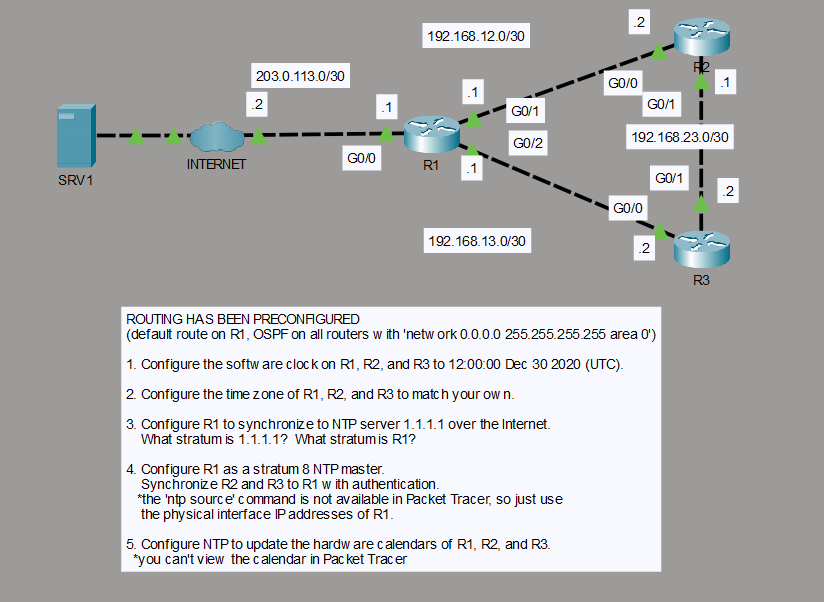

# NTP Time Synchronization

## Objective

I configured NTP time synchronization across three routers. R1 synchronizes with the external NTP server at 1.1.1.1, while R2 and R3 use R1 as their authenticated NTP source. I also configured the CET time zone and hardware calendar updates on all three routers.

## Topology

## Concepts

- Network Time Protocol (NTP)
- NTP stratum hierarchy
- External and internal time sources
- NTP authentication
- Local NTP master fallback
- Time zone configuration
- Hardware calendar synchronization

## Configuration Highlights

- R1 uses `1.1.1.1` as its upstream NTP server and operates at stratum 2 while synchronized to that source.
- R1 is also configured as a local stratum-8 NTP master fallback using `ntp master`.
- R2 synchronizes to R1 through `192.168.12.1`, and R3 synchronizes through `192.168.13.1`.
- NTP authentication is enabled between R1 and the downstream routers.
- `ntp update-calendar` is configured on R1, R2, and R3.

## Verification

I verified synchronization with `show clock detail`, `show ntp associations`, and `show ntp status`.

- R1 synchronized to `1.1.1.1` and reported stratum 2.
- R2 synchronized to `192.168.12.1` and reported stratum 3.
- R3 synchronized to `192.168.13.1` and reported stratum 3.
- All three routers reported NTP as the active time source.

## Result

The routers formed a working NTP hierarchy with R1 synchronized to the external source and R2/R3 synchronized to R1 through authenticated NTP. Time zone and hardware calendar update settings were applied consistently across the routers.
