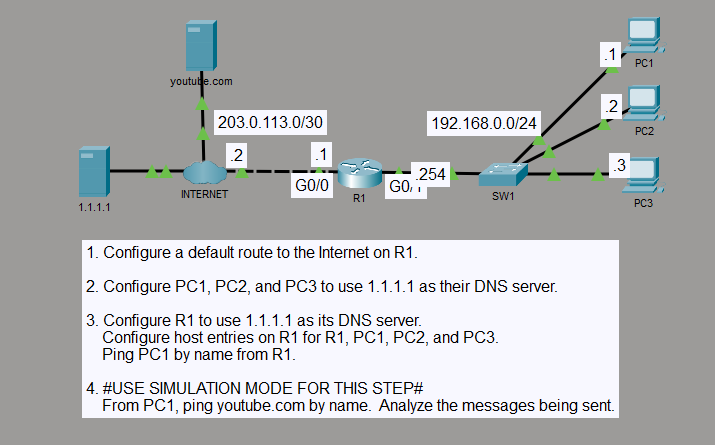

# DNS and Hostname Resolution

## Objective

I configured R1 with a default route toward the Internet and used `1.1.1.1` as the DNS server on R1 and all three PCs. I also configured static hostname mappings on R1 so the local PCs could be reached by name.

## Topology

## Concepts

- IPv4 default routing
- DNS name resolution
- Router DNS client configuration
- Static hostname mappings
- DNS query and response flow
- End-to-end ICMP connectivity

## Configuration Highlights

- R1 connects to the Internet through `203.0.113.1/30` and uses `203.0.113.2` as the default-route next hop.
- The LAN gateway is `192.168.0.254/24`.
- R1 and PC1, PC2, and PC3 use `1.1.1.1` as their DNS server.
- R1 contains static hostname mappings for PC1 (`192.168.0.1`), PC2 (`192.168.0.2`), PC3 (`192.168.0.3`), and R1 (`192.168.0.254`).

## Verification

I verified the default route and local hostname table on R1, then tested hostname-based reachability to the PCs. Client testing confirmed connectivity to `1.1.1.1` and DNS resolution of `youtube.com` to `172.217.6.78`.

In Simulation Mode, I observed the DNS exchange before the ICMP traffic generated by `ping youtube.com` from PC1.

## Result

R1 used the configured default route for external traffic and resolved the local hostnames to the correct LAN addresses. The PCs used `1.1.1.1` for DNS and reached the external host by name.
