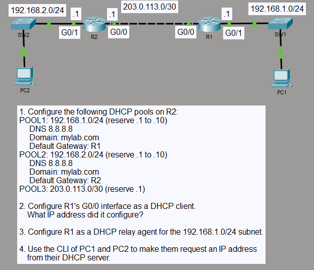

# DHCP Server, Client, and Relay

## Objective

I configured R2 as a DHCP server for three IPv4 networks. R1 uses DHCP on its inter-router interface and relays DHCP requests from the `192.168.1.0/24` LAN to R2, while PC2 receives its address directly from R2 on `192.168.2.0/24`.

## Topology

## Concepts

- DHCP server pools
- DHCP address exclusions
- DHCP client configuration
- DHCP relay with `ip helper-address`
- IPv4 static routing
- DNS and domain-name assignment through DHCP

## Configuration Highlights

- R2 provides DHCP service for `192.168.1.0/24`, `192.168.2.0/24`, and `203.0.113.0/30`.
- Addresses `.1` through `.10` are excluded from the two LAN pools, and `203.0.113.1` is excluded from the inter-router pool.
- R1 receives `203.0.113.2/30` through DHCP on `GigabitEthernet0/0`.
- R1 relays DHCP requests from the `192.168.1.0/24` LAN to R2 at `203.0.113.1`.
- Static routes provide return paths between the two LANs.

## Verification

I verified the DHCP pools and binding table on R2. The final bindings showed `192.168.1.11` for PC1, `192.168.2.11` for PC2, and `203.0.113.2` for R1.

PC1 and PC2 received the correct subnet mask, default gateway, DNS server `8.8.8.8`, and `mylab.com` domain suffix. Both clients reached their local default gateways, and R2 reached R1's `192.168.1.1` LAN interface.

## Result

R2 provided centralized DHCP service to both a directly connected LAN and a remote LAN through R1. R1 also operated as a DHCP client on the inter-router network while forwarding DHCP requests from PC1 through the relay configuration.
