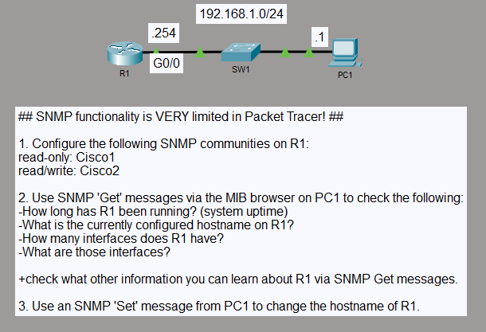
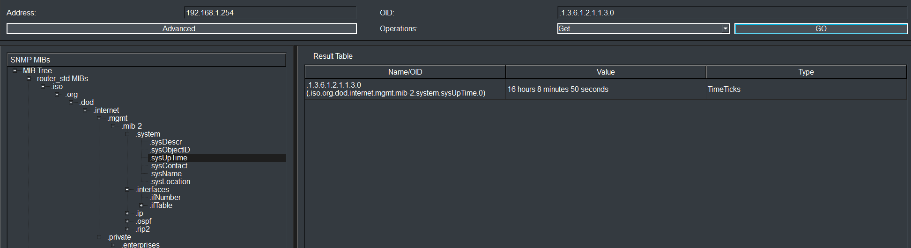
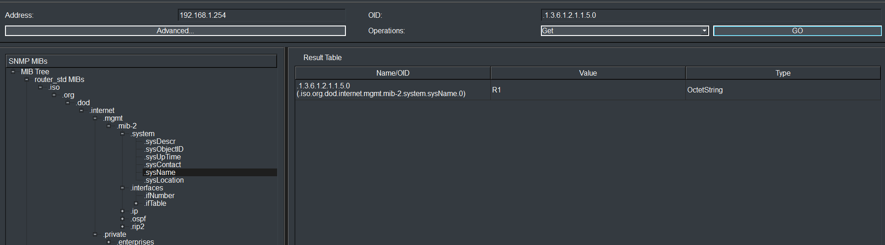
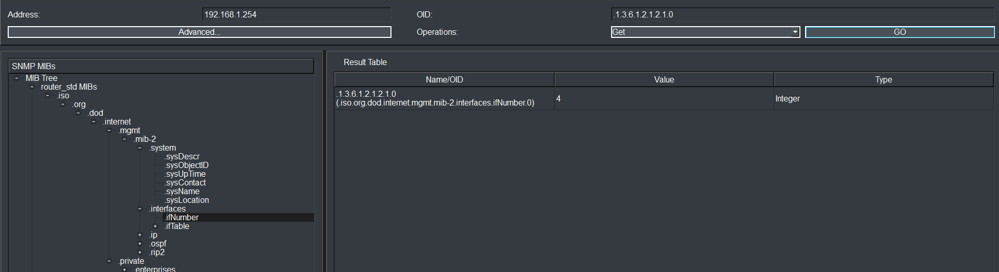
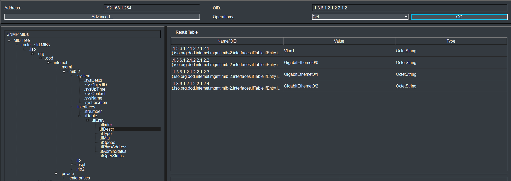
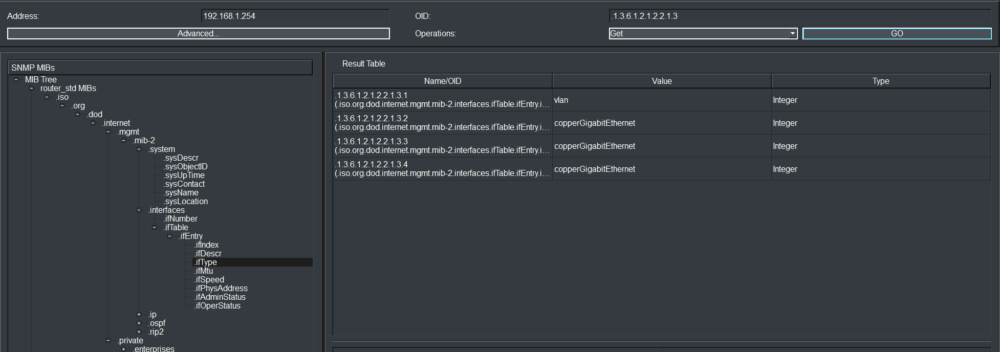
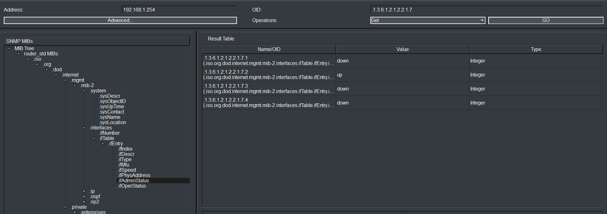
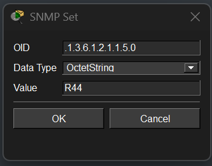

# SNMP Monitoring and Management

## Objective

I configured SNMP access on a Cisco router with separate read-only and read-write communities. From PC1, I used the MIB Browser to retrieve system and interface information and then used an SNMP Set operation to change the router hostname from `R1` to `R44`.

## Topology

## Concepts

- SNMP network management
- MIB-II objects and OIDs
- SNMP Get and Set operations
- Read-only and read-write communities
- System and interface monitoring

## Configuration Highlights

- The router management interface uses `192.168.1.254/24` on `GigabitEthernet0/0`.
- Separate SNMP communities provide read-only and read-write access.
- MIB-II system and interface objects were queried from PC1.
- An SNMP Set operation on `sysName.0` changed the router hostname from `R1` to `R44`.

## Verification

I first used SNMP Get requests to read system information from R1. `sysUpTime.0` returned 16 hours, 8 minutes, and 50 seconds, while `sysName.0` returned the original hostname `R1`.

I then queried the interface MIB. `ifNumber.0` reported four interfaces, and `ifDescr` identified them as `Vlan1`, `GigabitEthernet0/0`, `GigabitEthernet0/1`, and `GigabitEthernet0/2`.

Additional Get requests showed the interface types and administrative states. `GigabitEthernet0/0` was administratively up, while the remaining interfaces were down.

Finally, I used the read-write SNMP community to send a Set request to `sysName.0` with the value `R44`.

The final router running configuration confirmed that the SNMP Set operation changed the hostname to `R44`.

## Result

SNMP Get operations retrieved system and interface information from the router, and the SNMP Set operation changed the router hostname through the MIB Browser. The final configuration confirmed the hostname as `R44`.
