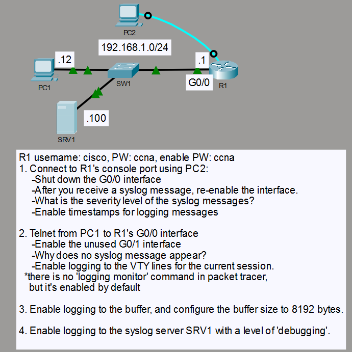
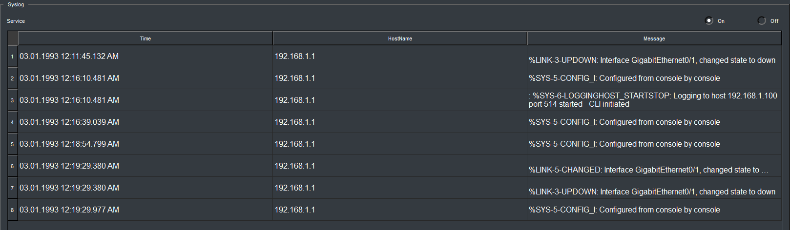

# Syslog Logging and Monitoring

## Objective

I configured Cisco IOS logging to observe interface events locally and send Syslog messages to a remote server. I also verified console logging, VTY session monitoring, timestamped messages, buffered logging, and remote logging at the debugging level.

## Topology

## Concepts

- Cisco IOS Syslog
- Syslog severity levels
- Console and VTY monitoring
- Buffered logging
- Remote Syslog server
- Logging timestamps

## Configuration Highlights

- Logging messages include date/time timestamps with milliseconds.
- R1 sends Syslog messages to `192.168.1.100` using the debugging severity threshold.
- The local logging buffer was configured to 8192 bytes.
- `terminal monitor` was enabled for the active Telnet session to display Syslog messages remotely.

## Verification

Shutting down and re-enabling `GigabitEthernet0/0` generated `%LINK-5-CHANGED` and `%LINEPROTO-5-UPDOWN` messages, confirming severity level 5 notifications and timestamped console logging.

The Telnet session displayed interface logging messages after terminal monitoring was enabled. `show logging` confirmed an 8192-byte log buffer and remote trap logging at the debugging level.

SRV1 received Syslog messages from R1 at `192.168.1.1`.

## Result

R1 generated timestamped Syslog events locally, displayed them in the active VTY session, stored messages in an 8192-byte buffer, and forwarded logging messages to SRV1.
