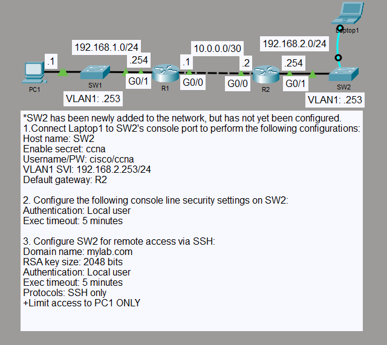

# SSH Secure Remote Access

## Objective

I secured management access to SW2 by using local authentication for console and SSH sessions. Remote SSH access was restricted so only PC1 could manage the switch across the routed network.

## Topology

## Concepts

- SSH remote management
- Local user authentication
- RSA key-based SSH setup
- Management SVI
- Default gateway for switch management
- Standard ACL applied to VTY access
- Console and VTY session timeouts

## Configuration Highlights

- SW2 uses VLAN 1 address `192.168.2.253/24` with `192.168.2.254` as its default gateway.
- Local authentication is required on both the console and VTY lines.
- VTY access accepts SSH only and uses a five-minute inactivity timeout.
- A standard ACL permits remote management only from PC1 at `192.168.1.1`.
- The `mylab.com` domain and RSA key pair support SSH operation.

## Verification

I verified IP connectivity from PC1 to the SW2 management address and successfully opened an SSH session using the local account.

I also confirmed that an SSH attempt from R2 was refused, proving that the VTY ACL restricted remote management to PC1. Console login was tested separately with the local username and password.

## Result

SW2 can be managed locally through the console and remotely through SSH. Remote VTY access is limited to PC1, while other sources are blocked by the management ACL.
