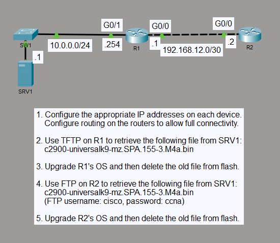

# IOS Image Upgrade with TFTP and FTP

## Objective

I upgraded the IOS image on two routers by transferring the same image from SRV1 with two different file-transfer methods. R1 retrieved the image with TFTP, while R2 used authenticated FTP before both routers were configured to boot from the new image.

## Topology

## Concepts

- Cisco IOS image management
- TFTP file transfer
- Authenticated FTP file transfer
- Flash storage management
- Boot system configuration
- OSPF connectivity
- IOS upgrade verification

## Configuration Highlights

- R1 uses `10.0.0.254/24` toward the server network and `192.168.12.1/30` toward R2.
- R2 uses `192.168.12.2/30` and reaches the server network through OSPF.
- R1 retrieved `c2900-universalk9-mz.SPA.155-3.M4a.bin` from SRV1 with TFTP.
- R2 retrieved the same IOS image from SRV1 with authenticated FTP.
- Both routers use `boot system flash c2900-universalk9-mz.SPA.155-3.M4a.bin` and the previous IOS image was removed from flash.

## Verification

I verified end-to-end connectivity between the routers and SRV1 before checking the final upgrade state.

- `dir flash:` confirmed that the new IOS image was present and the previous image had been removed.
- `show version` confirmed that both routers were running IOS 15.5(3)M4a from the new flash image.
- R2 reached `10.0.0.0/24` through R1, and the OSPF adjacency between R1 and R2 was in the FULL state.
- ICMP and traceroute tests confirmed connectivity from R2 to SRV1 through R1.

## Result

Both routers booted from the upgraded IOS image and retained full network connectivity. The lab demonstrated IOS image transfer with TFTP and authenticated FTP, boot-image selection, flash cleanup, and post-upgrade verification.
