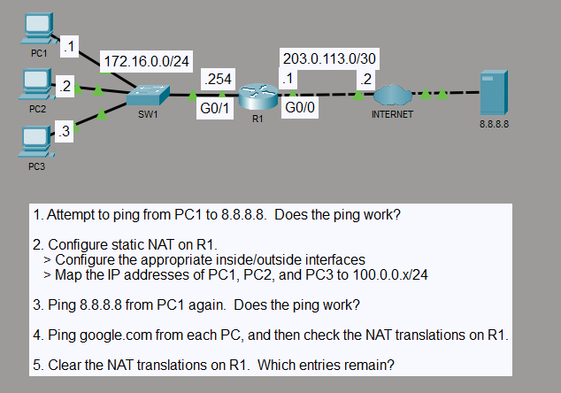

# Static NAT Address Translation

## Objective

I configured one-to-one static NAT on R1 for three hosts in the `172.16.0.0/24` LAN. Each inside-local address is mapped to a fixed inside-global address in the `100.0.0.0/24` range, allowing the hosts to reach external destinations through R1.

## Topology

## Concepts

- Static one-to-one NAT
- Inside and outside NAT interfaces
- Inside-local and inside-global addressing
- IPv4 default routing
- ICMP and DNS traffic verification

## Configuration Highlights

- `GigabitEthernet0/1` is the NAT inside interface with `172.16.0.254/24`.
- `GigabitEthernet0/0` is the NAT outside interface with `203.0.113.1/30`.
- `172.16.0.1`, `172.16.0.2`, and `172.16.0.3` are statically mapped to `100.0.0.1`, `100.0.0.2`, and `100.0.0.3`.
- R1 uses a default route through `203.0.113.2` for external traffic.

## Verification

Before NAT was configured, PC1 could not reach `8.8.8.8`. After the static mappings were applied, PC1 reached `8.8.8.8`, and all three PCs reached `google.com`.

`show ip nat translations` displayed ICMP and DNS-related translations using the configured inside-global addresses. After clearing the dynamic translations, the temporary entries were removed while all three static mappings remained. `show ip nat statistics` also confirmed the inside/outside interfaces and translation activity.

## Result

R1 translated each LAN host to its dedicated inside-global address and maintained the static mappings independently of temporary traffic entries. External ICMP and DNS-based connectivity worked through the configured NAT boundary.
