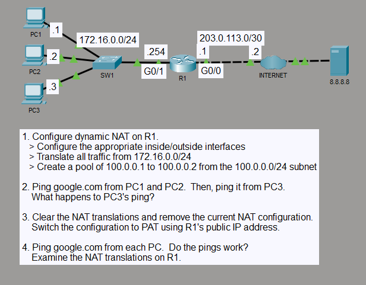

# Dynamic NAT and PAT Address Translation

## Objective

I configured dynamic NAT on R1 for hosts in the `172.16.0.0/24` LAN using a two-address public pool. I then replaced the pool-based translation with PAT so all three hosts could share R1's public interface address.

## Topology

## Concepts

- Dynamic NAT
- NAT pool exhaustion
- Port Address Translation (PAT)
- Inside and outside NAT interfaces
- Standard ACL traffic matching
- IPv4 default routing
- ICMP and DNS traffic verification

## Configuration Highlights

- `GigabitEthernet0/1` is the NAT inside interface with `172.16.0.254/24`.
- `GigabitEthernet0/0` is the NAT outside interface with `203.0.113.1/30`.
- Dynamic NAT initially used the `100.0.0.1`–`100.0.0.2` pool for the `172.16.0.0/24` LAN.
- With both pool addresses in use, the third host could not create another translation.
- I then removed the pool-based NAT configuration and configured PAT with R1's `203.0.113.1` outside-interface address.
- R1 uses a default route through `203.0.113.2` for external traffic.

## Verification

With dynamic NAT active, PC1 and PC2 reached `google.com`, while PC3 could not obtain a translation after the two-address pool was exhausted.

After switching to PAT, PC1, PC2, and PC3 all reached `google.com`. `show ip nat translations` showed all three inside-local addresses using `203.0.113.1` as the inside-global address while separate translation identifiers distinguished their traffic. `show ip nat statistics` confirmed `GigabitEthernet0/1` as the inside interface and `GigabitEthernet0/0` as the outside interface.

## Result

The lab demonstrated the address limitation of a small dynamic NAT pool and how PAT allows multiple inside hosts to share one public IPv4 address. The final configuration uses R1's outside-interface address for overloaded translations.
