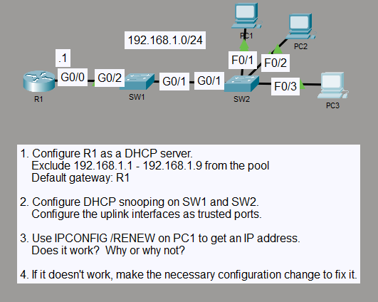

# DHCP Snooping and Option 82 Troubleshooting

## Objective

I configured DHCP snooping across two switches while R1 provided DHCP service for the `192.168.1.0/24` LAN. I then corrected the Option 82 behavior so clients could renew their leases through the protected switch path.

## Topology

## Concepts

- DHCP snooping
- Trusted and untrusted switch ports
- DHCP snooping binding tables
- DHCP Option 82
- DHCP lease verification
- Layer 2 security troubleshooting

## Configuration Highlights

- R1 provides DHCP service for `192.168.1.0/24` with `192.168.1.1` as the default gateway.
- Addresses `192.168.1.1` through `192.168.1.9` are excluded from dynamic allocation.
- DHCP snooping is enabled for VLAN 1 on SW1 and SW2.
- SW1 trusts `GigabitEthernet0/2` toward R1.
- SW2 trusts `GigabitEthernet0/1` toward SW1, while the client-facing ports remain untrusted.
- I disabled DHCP Option 82 insertion on both switches with `no ip dhcp snooping information option`.

## Verification

I verified DHCP snooping and the binding tables on both switches. The switches learned the three client leases at `192.168.1.10`, `192.168.1.11`, and `192.168.1.12`.

PC1 released and renewed its lease, received `192.168.1.10/24` with `192.168.1.1` as the default gateway, and reached R1 with 4 replies and 0% packet loss.

## Result

DHCP snooping remained active while legitimate DHCP lease renewal worked through both switches. The trusted uplinks and corrected Option 82 behavior allowed the clients to obtain addresses from R1 without disabling DHCP snooping protection.
