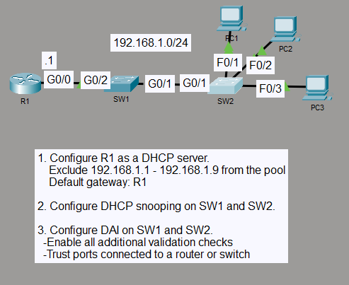

# Dynamic ARP Inspection with DHCP Snooping

## Objective

I configured DHCP snooping and Dynamic ARP Inspection (DAI) across two switches while R1 provided DHCP service for the `192.168.1.0/24` LAN. DAI used the DHCP snooping bindings to validate ARP traffic on untrusted ports.

## Topology

## Concepts

- DHCP snooping
- Dynamic ARP Inspection (DAI)
- Trusted and untrusted ports
- DHCP snooping binding tables
- Source MAC, destination MAC, and IP validation
- Layer 2 security

## Configuration Highlights

- R1 provides DHCP service for `192.168.1.0/24` with `192.168.1.1` as the default gateway.
- Addresses `192.168.1.1` through `192.168.1.9` are excluded from dynamic allocation.
- DHCP snooping and DAI are enabled for VLAN 1 on SW1 and SW2.
- DHCP Option 82 insertion is disabled on both switches.
- SW1 trusts `GigabitEthernet0/2` toward R1 for DHCP snooping and DAI.
- SW2 trusts `GigabitEthernet0/1` toward SW1, while the client-facing ports remain untrusted.
- SW1 keeps the downstream link toward SW2 untrusted so client bindings and ARP traffic can still be inspected at SW1.
- DAI validates source MAC, destination MAC, and IP information.

## Verification

I verified three DHCP leases at `192.168.1.10`, `192.168.1.11`, and `192.168.1.12` on R1 and matching DHCP snooping bindings on both switches. SW1 learned the clients through `GigabitEthernet0/1`, while SW2 learned them on `FastEthernet0/1` through `FastEthernet0/3`.

DAI was active on VLAN 1 with all three additional validation checks enabled and no validation failures. PC1, PC2, and PC3 all reached the default gateway at `192.168.1.1` successfully.

## Result

DHCP addressing and end-to-end connectivity remained functional while DHCP snooping and DAI protected the Layer 2 path. The switches maintained valid client bindings and inspected ARP traffic on untrusted ports.
